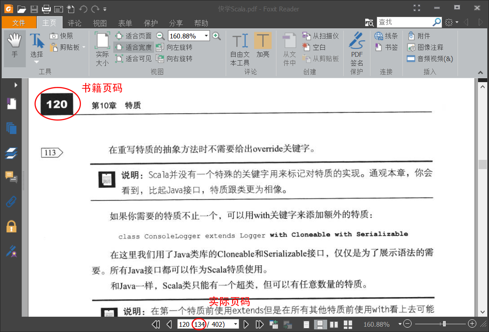
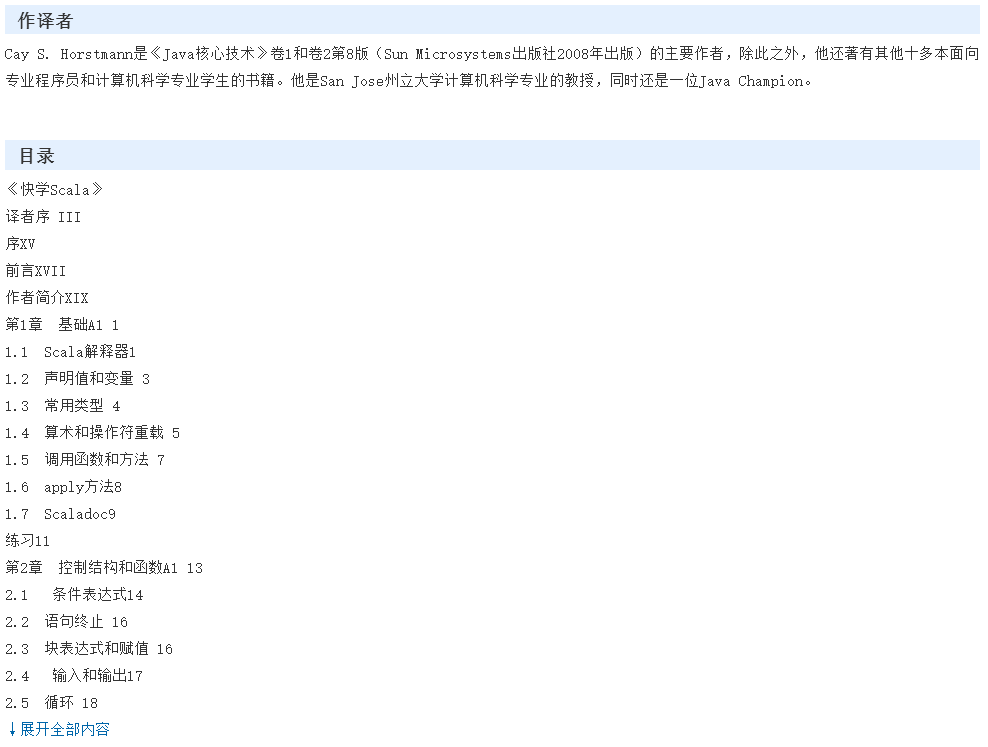
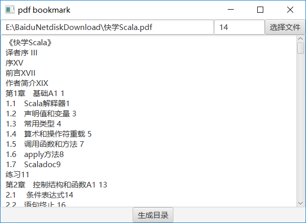
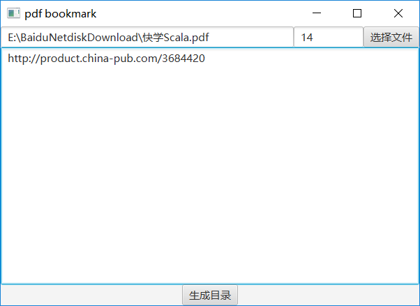
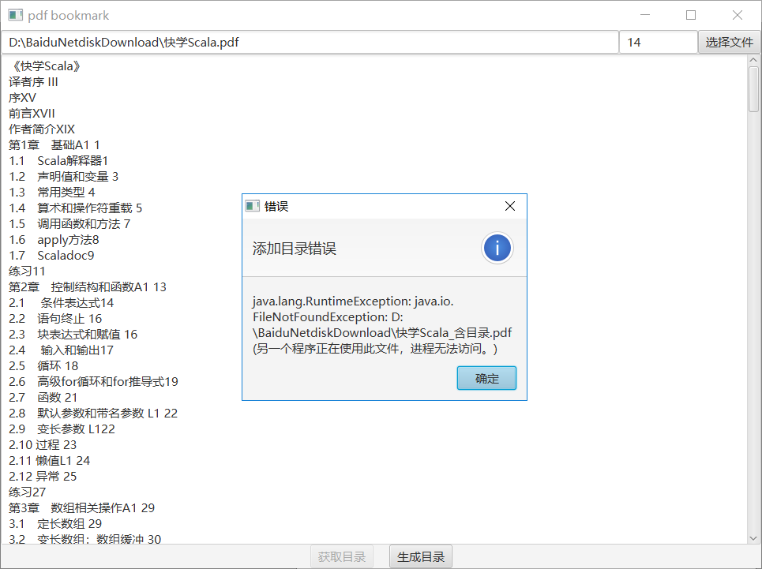
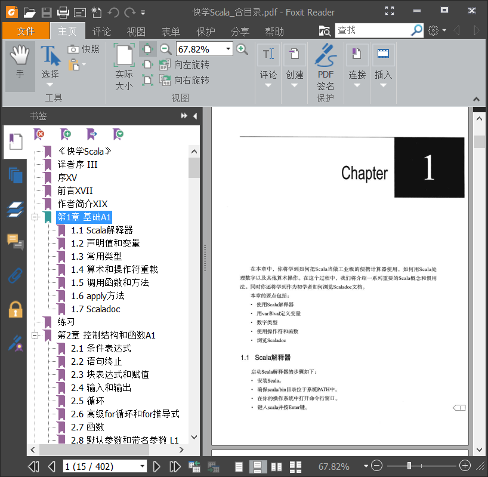

# pdf-bookmark - English
* Translated by Amin Yahyaabadi

## example


## download link
1. Download address: [pdf-bookmark] (https://github.com/ifnoelse/pdf-bookmark/releases)
2. Execution mode: execution `bin/pdf-bookmark`

>If pdf-bookmark not work，please build it by yourself
````
git clone https://github.com/ifnoelse/pdf-bookmark.git
cd pdf-bookmark
./gradlew jlink
build/image/bin/pdf-bookmark
````

## Introduction
Due to the existence of many pdf books without bookmarks on the Internet, it is very inconvenient to read. Manually adding bookmarks is too much work. This project is used to automatically bookmark pdf books for easy reading.
<br />**Software interface**
<br />

## Instructions
### 1. Select pdf file ###
Click the **Select File** button to select the pdf file to which you want to add the directory.
### 2. Fill in the page offset ###
Some pdfs are scanned, so the page number (book page number) in the directory may be different from the actual page number of the pdf file. The difference between the page number in the directory and the actual page number of the pdf file (actual page number - book page number) is the page number offset. the amount.
#### 2.1 How to determine the page offset: ####
Open the pdf file and turn the pdf to any page with the page number. As shown in the figure below, use the pdf reading software to view the page number and the actual page number in the book. Subtract the two numbers to get the page number offset, as shown in the figure below. Page offset is 134-120=14

### 3. Setting the directory contents ###
There are currently two ways to set the contents of the directory.
#### 3.1 Fill in the contents of the directory in the pdf-bookmark directory edit box (method 1)
#### 3.2 or the page url containing the contents of this book directory (url mode currently only supports china-pub) (method 2)
#### 3.3 Example
Suppose we want to automatically generate directory bookmarks for "Quick Scala". We can find the contents of the catalogue through the Internet bookstore. For example, [china-pub] (http://www.china-pub.com/), we can search for " Quickly learn the scala" details page `http://product.china-pub.com/3684420`, the following is a screenshot of the directory section

<br />The above is the book details page directory section of china-pub, you can click **↓ to expand the entire content** then copy the complete directory to the pdf-bookmark directory edit box, or directly fill this page url into the directory edit frame
<br /> ** Fill in the contents of the directory example **
<br />
<br />**fill in the url example**
<br />

### 4. Build directory ###
Clicking on the **Generate Directory** button will generate a new pdf file containing the directory, as shown below
<br />
<br /> Screenshot of the pdf directory after the generation
<br />
## About directory content format
The basic structure of the directory content format is `chapter number, chapter title, chapter page number, and the examples are as follows:
``` text
Chapter 1 Foundation A1 1
1.1 Scala Interpreter 1
1.2 Declaring values ​​and variables 3
1.3 Common Types 4
1.4 Arithmetic and Operator Overload 5
1.5 Calling Functions and Methods 7
1.6 apply method 8
1.7 Scaladoc9
```
